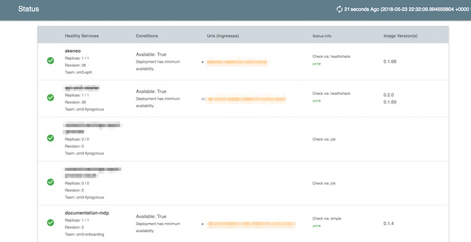

# Vistecture Dashboard

Docker: `aoepeople/vistecture-dashboard`

Works together with [Vistecture](https://github.com/aoepeople/vistecture) and shows the state of the vistecture architecture in kubernetes like this:




## Usage ##

You can use the Dockerimage. `aoepeople/vistecture-dashboard`

### Example Project

```
docker run --rm -ti -p 8080:8080 aoepeople/vistecture-dashboard
```

### Custom Project

```dockerfile
FROM aoepeople/vistecture-dashboard

COPY definition /definition

CMD ["-config", "/definition"]
```

### Vistecture Properties that are used:
The following "Properties" are used to control dashboard behaviour
(See example folder for an example)
- `deployment`: Has to be set to `kubernetes` (otherwise app is not checked)
- `healthCheckPath`: Healthcheck endpoint (relative path) (Optional - if not set just the base url is called) - If a healthCheckPath is configured it need to match the defined format (see below)
- `apiDocPath`: Optional the relative path to an API spec (just used to show a link)
- `k8sDeploymentName`: Override the name of the deployment in kubernetes that is checked(default = appname)
- `k8sHealthCheckServiceName`: Override service name that is used to check health (default = appname)
- `k8sHealthCheckThroughIngress`: If the app should be checked from public (ingress is required for the service)
- `k8sType`: set to "job" if the application is not represented by an deployment in kubernetes, but it is just a job

## Development: ##

```
# run
go run vistecture-dashboard.go
```

For a demo display please use:
```
go run vistecture-dashboard.go -config=example -Demo
```

And access it via http://localhost:8080
