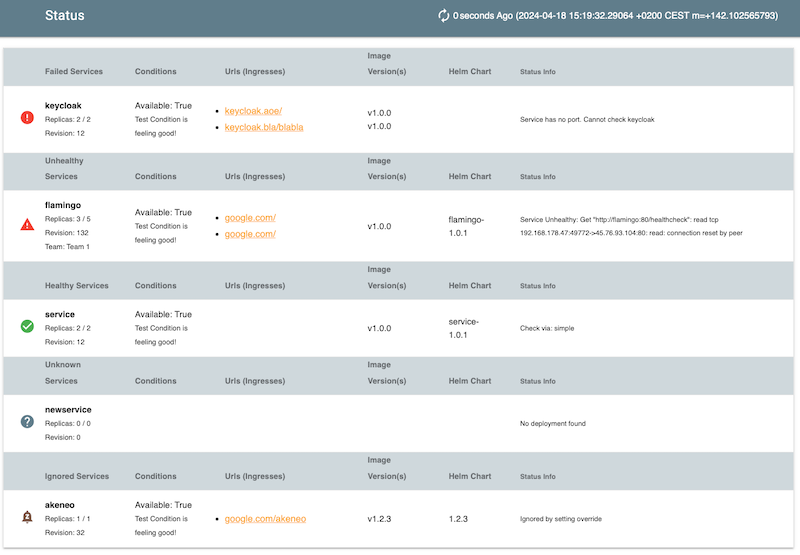

# Vistecture Dashboard

Docker: `aoepeople/vistecture-dashboard`

Works together with [Vistecture](https://github.com/aoepeople/vistecture) and shows the state of the vistecture architecture in kubernetes like this:




## Usage ##

You can use the Dockerimage: `aoepeople/vistecture-dashboard`

### Example Project

```shell
docker run --rm -ti -p 8080:8080 aoepeople/vistecture-dashboard
```

### Custom Project
Just copy your vistecture definitions into /vistecture/project.yml

The following Dockerfile could be used to build an image running the dashboard for your defined architecture:

```dockerfile
FROM aoepeople/vistecture-dashboard

COPY definition /definition
CMD ["-config", "/definition/project.yml"]
```

### Vistecture Properties that are used:
The following "Properties" are used to control dashboard behaviour
(See example folder for an example)
- `deployment`: Has to be set to `kubernetes` (otherwise app is not checked)
- `healthCheckPath`: Healthcheck endpoint (relative path) (Optional - if not set just the base url is called) - If a healthCheckPath is configured it need to match the defined format (see below)
- `healthCheckPort`: Healthcheck port (Optional - if not set then port with the name set in `healthCheckPortName` is looked up, and if it is also not found - then just first port of service is used)
- `healthCheckPortName`: Healthcheck port name (Optional - alternative to `healthCheckPort`)
- `apiDocPath`: Optional the relative path to an API spec (just used to show a link)
- `k8sDeploymentName`: Override the name of the deployment in kubernetes that is checked(default = appname)
- `k8sHealthCheckServiceName`: Override service name that is used to check health (default = appname)
- `k8sHealthCheckThroughIngress`: If the app should be checked from public (ingress is required for the service)
- `k8sType`: set to "job" if the application is not represented by a deployment in kubernetes, but it is just a job

### Healtcheck Format:

If a Healthcheck path is configured for the application the following format is evaluated:

```json
{
"services": [
    {
        "name": "session",
        "alive": true,
        "details": "success"
    },
    {
        "name": "magento",
        "alive": true,
        "details": "magento is alive"
    },
    {
        "name": "om3oms-rabbitMQ-publisher",
        "alive": false,
        "details": "dial tcp [::1]:5672: connect: connection refused"
    }
]
}
```

### Ignore/Silence services

T ignore failing services you can provide their `name` as ignore flags, e.g.

```shell
go run vistecture-dashboard.go -Demo -ignore akeneo -ignore flamingo
```

respectively adjust the command in your dockerfile

```dockerfile
CMD ["-config", "/definition/project.yml", "-ignore", "myApp", "-ignore", "otherApp"]
```

## Development:

run

```shell
go run vistecture-dashboard.go
```

For a demo display please use:

```shell
go run vistecture-dashboard.go -config=example/project.yml -Demo
```

And access it via http://localhost:8080
